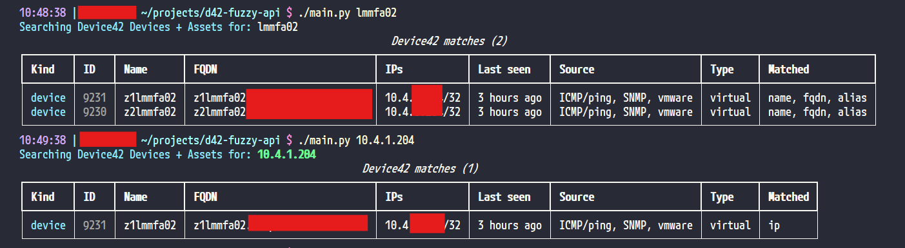

# d42-fuzzy-api

Fuzzy search Device42 **Devices** and **Assets** by hostname, FQDN/alias, or IP. Shows last seen, discovery source (SNMP, hypervisor, etc.), and FQDN.

## Setup

### 1. Device42 API client

In Device42: **Resources → Secrets → API Clients** → create a client.

- Resource Owner must be an **active non-Staff** user
- Download `client_key` and `secret_key` (secret is shown once)

### 2. Clone and install

**Linux / WSL / macOS**

```bash
git clone https://github.com/wastemans/d42-fuzzy-api.git
cd d42-fuzzy-api
python3 -m venv .venv
source .venv/bin/activate
pip install -r requirements.txt
cp config.ini.example config.ini
```

**Windows (PowerShell)**

```powershell
git clone https://github.com/wastemans/d42-fuzzy-api.git
cd d42-fuzzy-api
py -3 -m venv .venv
.\.venv\Scripts\Activate.ps1
pip install -r requirements.txt
copy config.ini.example config.ini
```

### 3. Configure

Edit `config.ini`:

```ini
[device42]
url = https://your-device42.example.com
client_key = YOUR_CLIENT_KEY
secret_key = YOUR_SECRET_KEY
verify_ssl = true
```

Set `verify_ssl = false` if the appliance uses a self-signed cert.

Or use env vars: `D42_URL`, `D42_CLIENT_KEY`, `D42_SECRET_KEY`, `D42_VERIFY_SSL`.

`config.ini` is gitignored. Do not commit secrets.

## Usage

```bash
python main.py web01
python main.py 10.20.30
python main.py --json kvm02
python main.py --pick web01
python main.py
```



On Windows, use `python` or `py` the same way after activating `.venv`.
